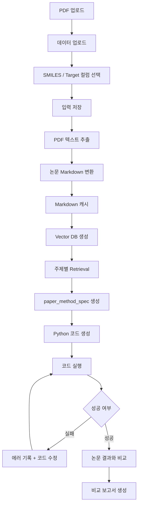
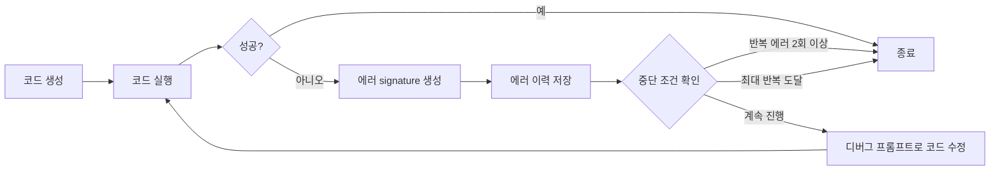
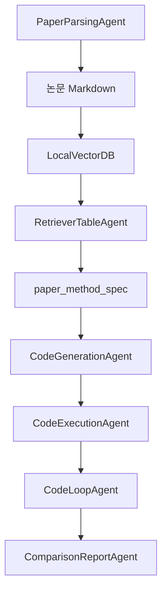
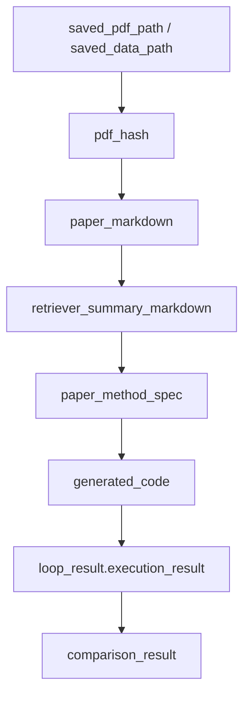

# Property Repro Platform 실행 흐름 정리

## 1. 시스템 개요

이 앱은 논문 PDF와 실험 데이터를 입력받아, 논문 속 boiling point 회귀 실험을 재현하기 위한 코드를 만들고 실행한 뒤, 논문 결과와 재현 결과를 비교하는 파이프라인입니다.

핵심은 다음 4단계입니다.

1. 논문을 구조화된 텍스트로 변환
2. 재현에 필요한 실험 조건을 구조화
3. 그 조건으로 코드를 생성하고 실행
4. 실행 결과를 논문 결과와 비교

---

## 2. 전체 실행 흐름

---

## 3. 사용자 기준 앱 프로세스

### 3-1. 입력 단계

사용자가 하는 일:

- 논문 PDF 업로드
- CSV / XLSX / XLS 업로드
- `SMILES` 컬럼 선택
- `boiling point` 타깃 컬럼 선택

앱이 저장하는 값:

- PDF 경로
- 데이터 경로
- PDF hash
- sheet name
- smiles column
- target column

이 값들은 이후 모든 단계의 공통 입력이 됩니다.

### 3-2. 논문 파싱 단계

처리 순서:

1. PDF에서 페이지별 텍스트 추출
2. 텍스트를 논문 구조가 보이는 Markdown으로 변환
3. `References`, `Appendix` 같은 비핵심 section 제거
4. PDF hash 기준으로 Markdown 캐시 저장

이 단계의 산출물:

- `paper_markdown`

### 3-3. RAG 단계

처리 순서:

1. Markdown을 chunk로 분할
2. OpenAI embedding 생성
3. local vector DB 저장
4. 아래 5개 주제로 각각 retrieval 수행

- `model`
- `feature`
- `hyperparameter`
- `training`
- `metrics`

이 단계의 산출물:

- `retrieved_by_topic`
- `vector_info`

### 3-4. 구조화 단계

`RetrieverTableAgent`가 topic별 retrieval 결과를 하나의 구조화 스펙으로 통합합니다.

생성되는 핵심 산출물:

- `summary_markdown`
- `paper_method_spec`

`paper_method_spec`에 들어가는 내용:

- 선택된 최종 모델
- feature 방식
- preprocessing
- hyperparameters
- training setup
- reported metrics
- evidence chunk / snippet

즉, 논문 내용을 바로 코드로 넘기지 않고, 먼저 실행에 필요한 형태로 정리합니다.

### 3-5. 코드 생성 단계

코드 생성 입력:

- `paper_markdown`
- `summary_markdown`
- `paper_method_spec`
- 데이터 파일 정보
- smiles / target 컬럼 정보

생성 규칙:

- `RDKit` 사용
- `sklearn` 사용
- `MAE`, `RMSE`, `MSE`, `R2` 포함
- 누락 정보는 default로 보완

생성 후 검증:

- 필수 라이브러리 포함 여부
- metric 포함 여부
- 구조화 spec과 모델 정렬 여부
- Python 코드 형식 검증

### 3-6. 실행 단계

생성된 코드는 파일로 저장된 뒤 subprocess로 실행됩니다.

실행 시 전달 정보:

- `--data-path`
- `--sheet-name`
- `--smiles-col`
- `--target-col`

실행 결과로 수집하는 값:

- return code
- stdout
- stderr
- parsed JSON output
- metrics

### 3-7. 디버그 루프 단계

실행에 실패하면 `CodeLoopAgent`가 자동으로 다음 과정을 반복합니다.

중단 조건:

- 실행 성공
- 같은 에러 2회 이상 반복
- 최대 반복 횟수 도달

디버그 입력:

- 현재 코드
- 최신 stderr / stdout
- 최근 에러 이력
- 원래 논문 정보

### 3-8. 비교 보고서 단계

실행이 끝나면 `ComparisonReportAgent`가 논문 스펙과 실행 결과를 비교합니다.

비교 입력:

- `paper_method_spec`
- generated code
- execution result

비교 산출물:

- comparison table
- analysis markdown
- 최종 report markdown 파일

---

## 4. 에이전트 구성

### PaperParsingAgent

- 입력: PDF에서 추출한 raw text
- 출력: 구조 유지 Markdown
- 역할: 논문 원문을 후속 처리 가능한 텍스트로 정리

### RetrieverTableAgent

- 입력: 주제별 retrieval 결과
- 출력: `summary_markdown`, `paper_method_spec`
- 역할: 비정형 검색 결과를 구조화된 실험 사양으로 변환

### CodeGenerationAgent

- 입력: 논문 정보 + structured spec + dataset info
- 출력: 실행 가능한 Python 코드
- 역할: 재현 코드 생성

### CodeExecutionAgent

- 입력: generated code + 실행 인자
- 출력: stdout / stderr / metrics / returncode
- 역할: 코드 실행과 결과 수집

### CodeLoopAgent

- 입력: 코드 생성 결과 + 실행 결과
- 출력: 최종 코드, 에러 이력, 최종 실행 결과
- 역할: 실패 시 자동 디버깅 루프 수행

### ComparisonReportAgent

- 입력: 논문 스펙 + 실행 결과
- 출력: 비교 표 + 분석 보고서
- 역할: 논문 대비 재현 결과 해석

---

## 5. 내부 데이터 흐름

앱은 FastAPI 세션 객체를 중심으로 단계별 산출물을 저장합니다.

주요 상태 흐름은 다음과 같습니다.

즉, 각 단계의 출력이 다음 단계의 입력으로 바로 연결됩니다.

---

## 6. 발표에서 설명하기 좋은 핵심 프로세스

### 프로세스 1. 논문을 바로 코드로 보내지 않음

논문 PDF -> Markdown -> Retrieval -> `paper_method_spec` 순서로 한 번 구조화한 뒤 코드 생성으로 넘어갑니다.

### 프로세스 2. Retrieval을 기능별로 분리

모델, 피처, 하이퍼파라미터, 학습, 메트릭을 각각 따로 검색해서 정보 혼합을 줄입니다.

### 프로세스 3. 코드 생성이 끝이 아니라 실행까지 포함

생성된 코드는 실제 스크립트로 실행되고, 성능 metric이 파싱되어 저장됩니다.

### 프로세스 4. 실패도 워크플로우 안에 포함

오류가 나면 다시 사람 개입 없이 `generate / run / debug` 루프를 수행합니다.

### 프로세스 5. 최종 출력은 보고서

최종 결과는 코드 파일 하나가 아니라, 논문 결과와 재현 결과를 나란히 비교한 보고서입니다.
